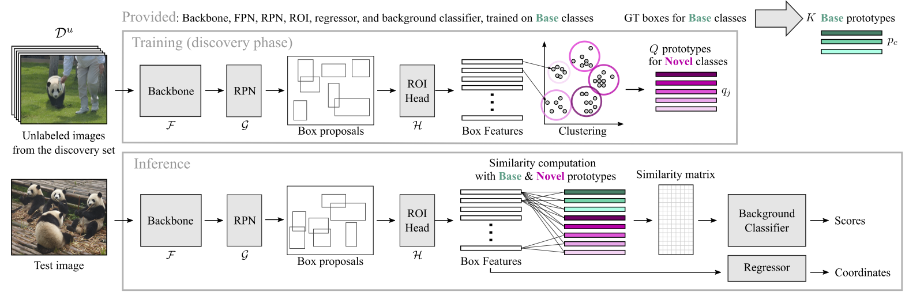
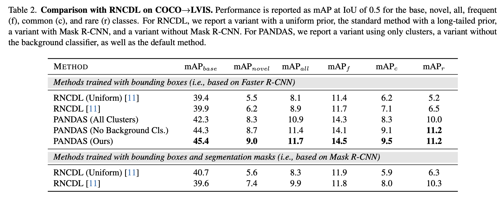

PANDAS: Prototype-based Novel Class Discovery and Detection
=====================================
This is PyTorch code for our paper available on [arXiv]().

**Abstract:** Object detectors are typically trained once and for all on a fixed set of classes. However, this closed-world assumption is unrealistic in practice, as new classes will inevitably emerge after the detector is deployed in the wild. In this work, we look at ways to extend a detector trained for a set of base classes so it can i) spot the presence of novel classes, and ii) automatically enrich its repertoire to be able to detect those newly discovered classes together with the base ones. We propose PANDAS, a method for novel class discovery and detection. It discovers clusters representing novel classes from unlabeled data, and represents old and new classes with prototypes. During inference, a distance-based classifier uses these prototypes to assign a label to each detected object instance. The simplicity of our method makes it widely applicable. We experimentally demonstrate the effectiveness of PANDAS on the VOC 2012 and COCO-to-LVIS benchmarks. It performs favorably against the state of the art for this task while being computationally more affordable.


**Overview of our approach.** Given an annotated training set and a detector trained for **Base** classes on that training set, we compute **Base** prototypes. Then components from this detector are used during the discovery phase to compute prototypes for the **Novel** classes using clustering (top). During inference, similarity scores of new box features to these prototypes are computed to provide predicted scores (bottom).


## Dependencies

We have tested the code with the packages and versions in [requirements.txt](requirements.txt).
We recommend setting up a `conda` environment with these same package versions:

```
conda create -n pandas_ncd python=3.9.16
conda activate pandas_ncd
conda install pytorch==1.12.1 torchvision==0.13.1 torchaudio==0.12.1 cudatoolkit=11.3 -c pytorch -c nvidia
conda install -c conda-forge faiss-cpu
conda install numpy==1.24.3
conda install -c anaconda pillow
conda install -c conda-forge tqdm
conda install scipy
conda install -c conda-forge pycocotools
pip install lvis
```

## Download Datasets

We download and extract the `VOC 2012`, `COCO 2017`, and `LVISv1` datasets as follows.

- [VOC 2012](http://host.robots.ox.ac.uk/pascal/VOC/voc2012/)
    - Download and extract the images and annotations for the VOC 2012 dataset.
    - Download the `10-10` folder of VOC from the WILSON repo 
    [here](https://github.com/fcdl94/WILSON/tree/main/data/voc/10-10). Then download `train_aug.txt` and `val.txt` from the WILSON repo [here](https://github.com/fcdl94/WILSON/tree/main/data/voc/splits). The `10-10` folder and two text files should all be in the same directory (e.g., `PANDAS/voc_splits`).

- [COCO 2017](https://cocodataset.org/#download)
    - Download and extract the images for the COCO 2017 dataset.
    - Download the `coco_half_train.json` and `coco_half_val.json` annotations files for base training from [the original RNCDL repo](https://github.com/vlfom/RNCDL).

- [LVISv1](https://www.lvisdataset.org/dataset)
    - Download the `train` (1 GB) and `val` (192 MB) json annotation files for the LVISv1 dataset.
    LVIS uses the same images as COCO 2017, so we do not need to download images.
    - We need to create two additional json annotation files: 1) `coco_half_train_lvis_ann.json` which is the same as `coco_half_train.json`, but uses the LVIS labels instead of COCO labels for the 80
    base classes and 2) `coco_second_half_train_lvis_ann.json` which contains the discovery
    set of LVIS images. To create these json files, change `lvis_root` (root to LVIS annotation files), `coco_half_root` (root to `coco_half` annotation files), and `save_path` (directory to save new json files) in `__main__` of [make_lvis_annotation_base.py](./make_lvis_annotation_base.py) and [make_lvis_annotation_discovery.py](./make_lvis_annotation_discovery.py) and then run both scripts. This may take a few minutes. Note that `hot_dog` is not in LVIS, so we set the category label as `-1` for `hot_dog` in `coco_half_train_lvis_ann.json`.


## Download Checkpoint

Download the self-supervised MoCo v2 ImageNet-1k checkpoint for ResNet-50 trained using 800 epochs from [this table](https://github.com/facebookresearch/moco#models) on the official MoCo repository.


## Base Phase on VOC

To replicate our base phase on VOC, we will use [voc_base.sh](./bash_scripts/voc_base.sh).

- First, change the appropriate paths in the bash file:
    - `PROJ_ROOT`: The directory for the PANDAS code.
    - `SAVE_PATH`: The directory to save results and log files. Note that a `logs` directory must be created manually inside the directory.
    - `SSL_CKPT`: The self-supervised MoCo v2 checkpoint file downloaded above.
    - `DATA_PATH`: The directory containing the `VOC2012` dataset.
    - `SPLIT_PATH`: The directory containing the 10-10 file splits for VOC (e.g., `PANDAS/voc_splits`)

- Then, to run the base training on VOC, run:
    ```
    ./bash_scripts/voc_base.sh
    ```

## Base Phase on COCO

To replicate our base phase on COCO Half, we will use [coco_base.sh](./bash_scripts/coco_base.sh).

- First, change the appropriate paths in the bash file:
    - `PROJ_ROOT`: The directory for the PANDAS code.
    - `SAVE_PATH`: The directory to save results and log files. Note that a `logs` directory must be created manually inside the directory.
    - `SSL_CKPT`: The self-supervised MoCo v2 checkpoint file downloaded above.
    - `IMAGES_PATH`: The directory containing the `COCO2017` dataset.
    - `COCO_HALF_ANNOTATION_ROOT`: The directory containing the `coco_half_train.json` and `coco_half_val.json` files from the RNCDL repo.

- Then, to run the base training on COCO Half, run:
    ```
    ./bash_scripts/coco_base.sh
    ```

## Discovery Phase on VOC

To replicate our main experiments with PANDAS on VOC, we will use [voc_ncd_main_experiment.sh](./bash_scripts/voc_ncd_main_experiment.sh).

- First, change the appropriate paths in the bash file:
    - `PROJ_ROOT`: The directory for the PANDAS code.
    - `SAVE_PATH`: The directory to save results and log files. Note that a `logs` directory must be created manually inside the directory.
    - `BASE_CKPT`: The base PyTorch checkpoint file saved out after training the base phase on VOC.
    - `DATA_PATH`: The directory containing the `VOC2012` dataset.
    - `SPLIT_PATH`: The directory containing the 10-10 file splits for VOC (e.g., `PANDAS/voc_splits`)

- Then, to run the PANDAS method using `{10, 20, 50, 100, 250, 500, 1000}` novel clusters on VOC, run:
    ```
    ./bash_scripts/voc_ncd_main_experiment.sh
    ```

- After the experiments have finished, the prototypes learned by PANDAS will be saved in:
    `{SAVE_PATH}/voc_discovery_10_10_clusters_{NUM_CLUSTERS}_pandas_seed_{SEED}/ncd_model.pth` 

- The associated results will be in the log file saved at:
    `{SAVE_PATH}/logs/voc_discovery_10_10_clusters_{NUM_CLUSTERS}_pandas_seed_{SEED}.log`

- Next, to run the additional studies for PANDAS, change the `PROJ_ROOT`, `SAVE_PATH`, `BASE_CKPT`, `DATA_PATH`, and
`SPLIT_PATH` variables in [voc_ncd_additional_studies.sh](./bash_scripts/voc_ncd_additional_studies.sh).
Note, this experiment will save out the same prototypes files and log files as our main experiments. Then, run:
    ```
    ./bash_scripts/voc_ncd_additional_studies.sh
    ```

- Finally, to compute the mean and standard deviation over runs for all VOC experiments, change `root_to_logs` of `__main__` in [analyze_voc_results.py](./analyze_voc_results.py) to `SAVE_PATH` and run the script. This will print the
results of all VOC experiments to the console.


## Discovery Phase on COCO --> LVIS

To replicate our main experiments with PANDAS on LVIS, we will use [lvis_ncd_main_experiment.sh](./bash_scripts/lvis_ncd_main_experiment.sh).

- First, change the appropriate paths in the bash file:
    - `PROJ_ROOT`: The directory for the PANDAS code.
    - `SAVE_PATH`: The directory to save results and log files. Note that a `logs` directory must be created manually inside the directory.
    - `BASE_CKPT`: The base PyTorch checkpoint file saved out after training the base phase on VOC.
    - `DATA_PATH`: The directory containing the `COCO2017` dataset.
    - `COCO_HALF_TRAIN_JSON`: The `coco_half_train_lvis_ann.json` json file we generated above.
    - `COCO_SECOND_HALF_TRAIN_JSON`: The `coco_second_half_train_lvis_ann.json` json file we generated above.
    - `LVIS_TRAIN_JSON`: The `lvis_v1_train.json` json file from LVISv1.
    - `LVIS_VAL_JSON`: The `lvis_v1_val.json` json file from LVISv1.

- Then, to run the PANDAS method using `{1000, 3000, 5000}` novel clusters on LVIS and the `All_Clusters` version of PANDAS with `5000` novel clusters, run:
    ```
    ./bash_scripts/lvis_ncd_main_experiment.sh
    ```

- After the main experiment script has finished running, we can evaluate PANDAS without a background classifier and `5000` novel clusters by changing the following paths in [lvis_additional_study.sh](./bash_scripts/lvis_additional_study.sh): `SAVE_PATH`, `BASE_CKPT`, `DATA_PATH`, `COCO_HALF_TRAIN_JSON`, `COCO_SECOND_HALF_TRAIN_JSON` `LVIS_TRAIN_JSON`, `LVIS_VAL_JSON`. Then run,
    ```
    ./bash_scripts/lvis_additional_study.sh
    ```

- Directories containing the final prototype models and results jsons will be in `SAVE_PATH` and the associated results logs will be in `SAVE_PATH/logs`.

- To evaluate an existing PANDAS checkpoint, simply add `--ncd_ckpt <PATH_TO_NCD_CHECKPOINT_FILE.pth>` to the desired bash script and run. 


## Results



## License
PANDAS

Copyright (C) 2023 NAVER Corp.

CC BY-NC-SA 4.0 license

See our [License File](./PANDAS-LICENSE.txt) for more details


## Citation

If using this code, please cite our paper.

```
@article{Hayes_2023_PANDAS,
  title={PANDAS: Prototype-based Novel Class Discovery and Detection},
  author={Hayes, Tyler L. and de Souza, Cesar and Kim, Namil and Kim, Jiwon and Volpi, Riccardo and Larlus, Diane},
  journal={arXiv preprint},
  year={2023}
}
```
